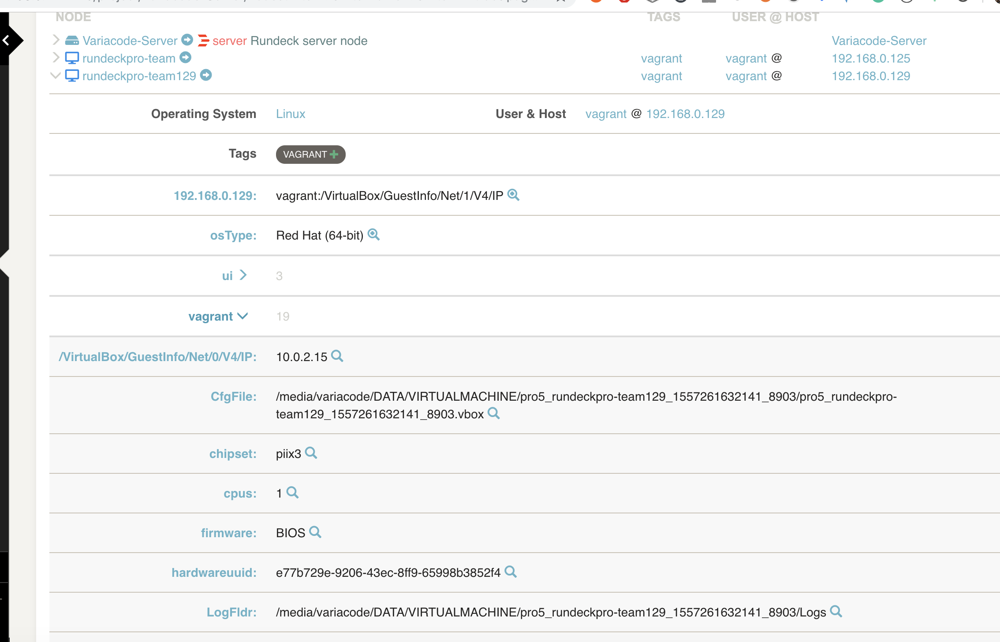

# Vagrant Rundeck Plugin

This is a vagrant plugin for rundeck.

## Build

* Using gradle
```
gradle clean build
```

## Requirements

* install python-vagrant library
```
pip install python-vagrant
```
https://github.com/todddeluca/python-vagrant

* install vagrant vm-info plugin

* rundeck and vagrant must be running with the same user

```
vagrant plugin install vagrant-vminfo
```

https://github.com/lynx-ua/vagrant-vminfo

## Install

```
cp build/libs/vagrant-plugin.zip $RDECK_BASE/libext
```

## Configuration

* Default attributes: add default attributes , like `username=vargant`
* IP Pattern: IP pattern that will be used as hostname




